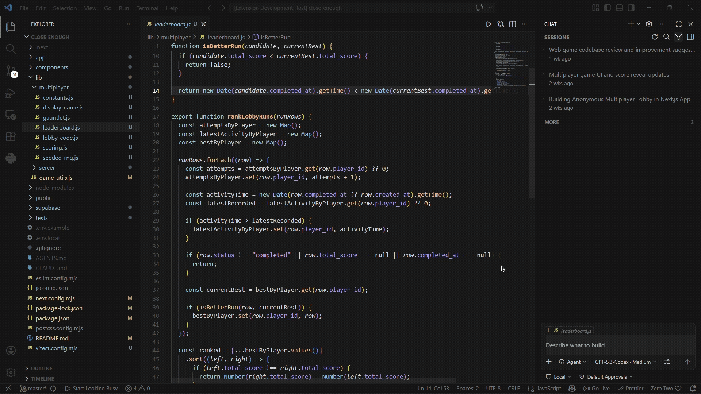
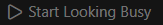
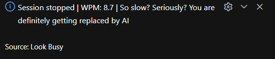

# Look Busy

Tired of watching reels between AI prompts?

**Look Busy** is a VS Code extension for people who want to look or feel intensely productive while their favourite AI coworker does the heavy lifting.

It gives you monkeytype-style typing practice using snippets from your own code, so from a distance it looks like you are shipping features at warp speed.

## What this masterpiece does

- Starts a typing session from real workspace files.
- Skips leading import/header boilerplate so you are not grinding through `import x from y` forever.
- Sometimes starts around the middle of longer files, because fake productivity deserves variety.
- Highlights untyped and mistyped characters as you type.
- Includes a panic kill switch: `Esc` (for when your boss spawns behind you to check if you can be replaced by an AI agent or not).
- Shows your WPM when the session ends, so you can measure how fast you can pretend.

## How to start looking busy

- Status bar: **Start Looking Busy** (one click).
- Command Palette: **Look Busy: Start Workspace Session**
- Shortcut: `Ctrl+Alt+B` / `Cmd+Alt+B`

## Notes

- Works with your open workspace files, or falls back to classic algorithm snippets if you don't have a workspace open.
- Source material is picked from common code file types (TS/JS/React/Vue/Svelte/Astro/Python/Go/Rust/Java/C/C++/C#/Dart/Zig/Lua/Elixir/PHP/Ruby/Swift/Kotlin/Scala/SQL/HTML/CSS/JSON/YAML/Shell/PowerShell/Markdown).
